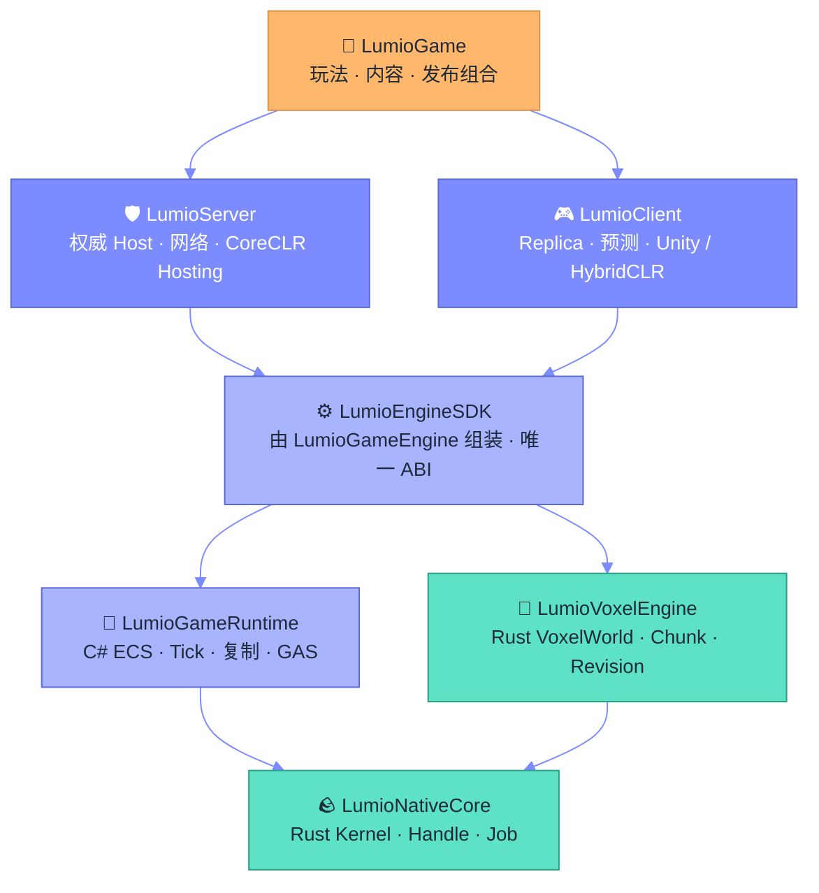

<div align="center">

<a href="https://github.com/LumioGames"></a>

</div>

<picture>
  <source media="(prefers-color-scheme: dark)" srcset="https://raw.githubusercontent.com/LumioGames/.github/main/profile/assets/sec-find-party-dark.svg">
  
</picture>

**先进群，再看代码。** QQ 群是交流群，什么都能聊；飞书三个是话题群，按你关心的层进。邀请链接会过期，二维码以这里为准。

<table>
<tr>
<td width="25%" align="center" valign="top">
<a href="https://qm.qq.com/q/PGkXh4tCyQ"></a><br>
<b>QQ 交流群</b><br><sub>群号 972220164 · 什么都能聊</sub>
</td>
<td width="25%" align="center" valign="top">
<a href="https://applink.feishu.cn/client/chat/chatter/add_by_link?link_token=b24vf257-5a2b-41ce-935e-bc4ce19dc396"></a><br>
<b>LumioGame 开发者社区</b><br><sub>飞书话题群 · 玩法、内容、发布</sub>
</td>
<td width="25%" align="center" valign="top">
<a href="https://applink.feishu.cn/client/chat/chatter/add_by_link?link_token=fffn1ae7-fd83-4315-96ac-6fa3aba3968e"></a><br>
<b>LumioEngine 开发者社区</b><br><sub>飞书话题群 · Rust / C# 引擎层</sub>
</td>
<td width="25%" align="center" valign="top">
<a href="https://applink.feishu.cn/client/chat/chatter/add_by_link?link_token=7bbl451c-aa1d-4e6d-a21c-fd1f1ebeb6b5"></a><br>
<b>Workflow 开发者社区</b><br><sub>飞书话题群 · Agent 与项目管理</sub>
</td>
</tr>
</table>

<div align="center">

<br>

### 体素引擎、专用服务器、Unity 客户端，全部公开在这里，由人和 Agent 照着同一本规则书一起写。

**A voxel game engine in Rust & C#, built by humans and coding agents who read the same rulebook.**

<br>

<a href="https://github.com/LumioGames/LumioNativeCore"></a>
<a href="https://github.com/LumioGames/LumioGameRuntime"></a>
<a href="https://agent-plugins.org/"></a>
<a href="https://github.com/LumioGames/LumioAgentSpec"></a>
<a href="https://github.com/LumioGames/LumioGameEngine/blob/main/LICENSE"></a>

</div>

<br>

<picture>
  <source media="(prefers-color-scheme: dark)" srcset="https://raw.githubusercontent.com/LumioGames/.github/main/profile/assets/sec-stage-select-dark.svg">
  
</picture>

四条主线。想知道我们怎么做游戏，从这四个仓库进。

<table>
<tr>
<td width="50%" valign="top">
<a href="https://github.com/LumioGames/LumioGame"></a>

### [LumioGame](https://github.com/LumioGames/LumioGame) <sub>🏰 PRODUCT · 游戏本体</sub>

游戏产品本身。玩法、复制映射、配表、内容、Scenario、存档迁移和发布清单，在这一层拼成一个具体的游戏。第一个垂直切片是放下一个方块：要过权限、资源、Chunk 校验和跨 World 事务，重复命令不会二次扣费。

<a href="https://github.com/LumioGames/LumioGame/stargazers"></a>


</td>
<td width="50%" valign="top">
<a href="https://github.com/LumioGames/LumioGameEngine"></a>

### [LumioGameEngine](https://github.com/LumioGames/LumioGameEngine) <sub>⚙️ ENGINE · SDK 组装根</sub>

引擎的组装根。把领域无关的 Rust Native Kernel、Voxel 引擎和 C# 托管 Runtime 装成一个可发布的 LumioEngineSDK，Server 和 Client 只认它给出的 API / ABI 边界。每次构建都算 BuildId、ABI Hash 和 SHA-256，Host 启动时逐项核对，"跑起来了"以哈希为准。

<a href="https://github.com/LumioGames/LumioGameEngine/stargazers"></a>


</td>
</tr>
<tr>
<td width="50%" valign="top">
<a href="https://github.com/LumioGames/LumioAgentSpec"></a>

### [LumioAgentSpec](https://github.com/LumioGames/LumioAgentSpec) <sub>📜 FRAMEWORK · Agent 规则书</sub>

一个框架管住所有编码 Agent。Claude Code、Codex、Cursor、Grok 随便换，项目的规则、知识、决策和任务进度都留在仓库里的 `.spec/`，不留在任何一个 Agent 的记忆里。写代码的不审自己的代码，"完成"由 lint、测试和收口门禁说了算。

<a href="https://github.com/LumioGames/LumioAgentSpec/stargazers"></a>


</td>
<td width="50%" valign="top">
<a href="https://github.com/LumioGames/workflow-plugin"></a>

### [workflow-plugin](https://github.com/LumioGames/workflow-plugin) <sub>🔌 PLUGIN · 项目管理</sub>

让 AI 不只写代码，还替你管项目。把 Claude Code、Cursor、Codex 接进 [Workflow](https://workflow.games)：一句话拆成能直接派活的开发蓝图，带查重记 bug，在真实线上环境跑测验收，按判定流转工单。每一次写入都要读回验证，才允许说"成功"。

<a href="https://github.com/LumioGames/workflow-plugin/stargazers"></a>


</td>
</tr>
</table>

<br>

<picture>
  <source media="(prefers-color-scheme: dark)" srcset="https://raw.githubusercontent.com/LumioGames/.github/main/profile/assets/sec-tech-tree-dark.svg">
  
</picture>

引擎按依赖方向分四级，箭头只能往下指。上层拼装下层，下层不知道上层是谁。



| 层 | 仓库 | 语言 | 拥有什么 | 不碰什么 |
| :-- | :-- | :-- | :-- | :-- |
| **LV.4 产品** | [LumioGame](https://github.com/LumioGames/LumioGame) | C# | 玩法语义、Mapping、配置、内容、发布清单 | Native、Voxel 内部、Host 进程 |
| **LV.3 Host** | [LumioServer](https://github.com/LumioGames/LumioServer) | Rust + C# | 专用服务器进程、网络、Session、WorldSlot、CoreCLR Hosting | Runtime 语义、玩法规则 |
| **LV.3 Host** | [LumioClient](https://github.com/LumioGames/LumioClient) | C# | 连接、Replica、预测回滚、Unity / HybridCLR 适配、Headless Bot | Server 权威、玩法内容 |
| **LV.2 SDK** | [LumioGameEngine](https://github.com/LumioGames/LumioGameEngine) | Rust + C# | SDK 组装、Native 聚合、ABI / Binding 生成、共享 Loader、开发启动器 | 具体玩法、Host 业务 |
| **LV.2 Runtime** | [LumioGameRuntime](https://github.com/LumioGames/LumioGameRuntime) | C# | ECS、Tick、Coordinator、Replication、GAS、Persistence、热重载 | 进程、Socket、Voxel 内部 |
| **LV.1 Native** | [LumioVoxelEngine](https://github.com/LumioGames/LumioVoxelEngine) | Rust | VoxelWorld、Chunk、Revision、Mutation、Streaming、Snapshot | 玩法权限、Socket、Host 生命周期 |
| **LV.1 Native** | [LumioNativeCore](https://github.com/LumioGames/LumioNativeCore) | Rust | 领域无关 Kernel、Handle、Error、Capability、内存与 Job | Voxel、ECS、网络 |
| **配置表** | [LumioConfig](https://github.com/LumioGames/LumioConfig) | Python | Schema 优先的配表源、编译器与导出工具 | 运行时逻辑 |

<br>

<picture>
  <source media="(prefers-color-scheme: dark)" srcset="https://raw.githubusercontent.com/LumioGames/.github/main/profile/assets/sec-the-crew-dark.svg">
  
</picture>

这支队伍里有人，也有 Agent。区别只有一个：人拍板，Agent 干活，两边看的是同一本规则书。

**主 Agent 调度，子 Agent 执行，Skill 是方法，`.md` 是规则。**

| 🕹️ 招式 | 谁出手 | 打出什么 |
| :-- | :-- | :-- |
| `brainstorming` | 主 Agent + 人 | 先把意图、需求和设计谈清楚，再动手 |
| `writing-plans` | 主 Agent | 先切契约卡，再把剩下的拆成互不重叠的任务卡 |
| `subagent-driven-development` | 子 Agent，按 wave 并行 | 各自在独立 worktree 里实现，改完带证据交回 |
| `reviewer` | 一个只负责挑刺的子 Agent | 假设交付是坏的，然后证明它；写的人永远不审自己 |
| `closeout-gate` | 机器 | 看 diff 决定要不要审、审多深；lint 挂了就拦住提交 |
| `/workflow:plan` · `/workflow:qa` | Agent 直连 [Workflow](https://workflow.games) | 一句话落成需求单，改完在真实线上环境复测，状态自己流转 |

装上同一套规则书，你的 Agent 也能入队：

```bash
# Agent 规则书：规则、知识、任务进度都进 .spec/
claude plugin marketplace add LumioGames/LumioAgentSpec && claude plugin install lumio@lumioagentspec
```

```bash
# 项目管理：Claude Code / Cursor / Codex 直连 Workflow
npx plugins add LumioGames/workflow-plugin
```

<br>

<picture>
  <source media="(prefers-color-scheme: dark)" srcset="https://raw.githubusercontent.com/LumioGames/.github/main/profile/assets/sec-3-lives-dark.svg">
  
</picture>

三条命，掉一条就得重来。所有仓库通用。

<table>
<tr>
<td width="33%" valign="top" align="center">


**证据先于声称**

构建算哈希，Host 启动时逐项核对。Agent 说"通过"不算数，命令和它的输出才算。

</td>
<td width="33%" valign="top" align="center">


**写的人不审自己**

reviewer 的唯一工作是假设你的交付是坏的，然后证明它。自审是已知降级，永远不是默认。

</td>
<td width="33%" valign="top" align="center">


**契约只有一份真值**

ABI 从 `native-abi.json` 生成，Wire 协议从 `hello-wire-v1.json` 生成。手写第二套布局，出局。

</td>
</tr>
</table>

<br>

<picture>
  <source media="(prefers-color-scheme: dark)" srcset="https://raw.githubusercontent.com/LumioGames/.github/main/profile/assets/sec-join-dark.svg">
  
</picture>

给仓库点一颗 ⭐ 就算投币。Issue 和 PR 都欢迎，架构问题去 [LumioGameEngine](https://github.com/LumioGames/LumioGameEngine/issues)，Agent 框架问题去 [LumioAgentSpec](https://github.com/LumioGames/LumioAgentSpec/issues)。

想直接聊，二维码在页首。不方便扫的，点这几个链接也能进：

<a href="https://qm.qq.com/q/PGkXh4tCyQ"></a>
<a href="https://applink.feishu.cn/client/chat/chatter/add_by_link?link_token=b24vf257-5a2b-41ce-935e-bc4ce19dc396"></a>
<a href="https://applink.feishu.cn/client/chat/chatter/add_by_link?link_token=fffn1ae7-fd83-4315-96ac-6fa3aba3968e"></a>
<a href="https://applink.feishu.cn/client/chat/chatter/add_by_link?link_token=7bbl451c-aa1d-4e6d-a21c-fd1f1ebeb6b5"></a>

<div align="center">


<sub>像素图全是 SVG，在 <a href="https://github.com/LumioGames/.github">LumioGames/.github</a> 里现画的，没用一张外部图片。</sub>

</div>
