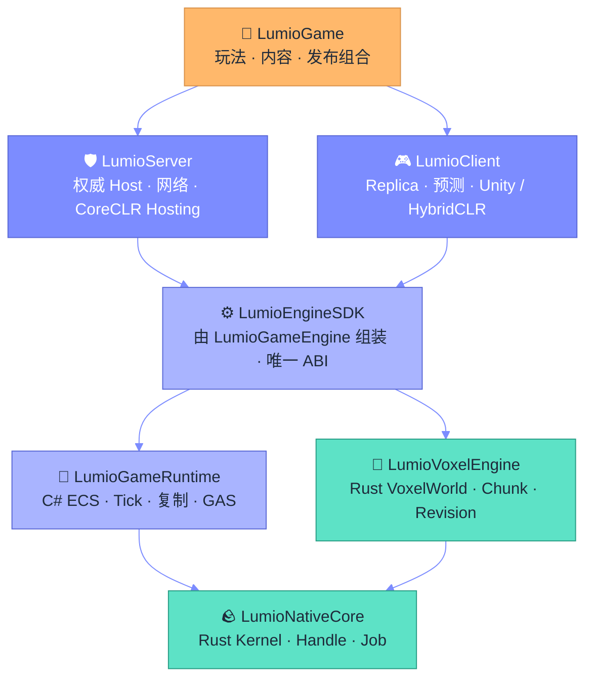

<div align="center">

<a href="https://github.com/LumioGames"></a>

</div>

<picture>
  <source media="(prefers-color-scheme: dark)" srcset="https://raw.githubusercontent.com/LumioGames/.github/main/profile/assets/sec-find-party-dark.svg">
  
</picture>

先进群再看代码。QQ 群什么都聊，飞书三个群按话题分，想聊哪块就进哪个。

<table>
<tr>
<td width="25%" align="center" valign="top">
<a href="https://qm.qq.com/q/PGkXh4tCyQ"></a><br>
<a href="https://qm.qq.com/q/PGkXh4tCyQ"></a><br><sub>什么都能聊</sub>
</td>
<td width="25%" align="center" valign="top">
<a href="https://applink.feishu.cn/client/chat/chatter/add_by_link?link_token=b24vf257-5a2b-41ce-935e-bc4ce19dc396"></a><br>
<a href="https://applink.feishu.cn/client/chat/chatter/add_by_link?link_token=b24vf257-5a2b-41ce-935e-bc4ce19dc396"></a><br><sub>飞书话题群 · 玩法、内容、发布</sub>
</td>
<td width="25%" align="center" valign="top">
<a href="https://applink.feishu.cn/client/chat/chatter/add_by_link?link_token=fffn1ae7-fd83-4315-96ac-6fa3aba3968e"></a><br>
<a href="https://applink.feishu.cn/client/chat/chatter/add_by_link?link_token=fffn1ae7-fd83-4315-96ac-6fa3aba3968e"></a><br><sub>飞书话题群 · Rust / C# 引擎层</sub>
</td>
<td width="25%" align="center" valign="top">
<a href="https://applink.feishu.cn/client/chat/chatter/add_by_link?link_token=7bbl451c-aa1d-4e6d-a21c-fd1f1ebeb6b5"></a><br>
<a href="https://applink.feishu.cn/client/chat/chatter/add_by_link?link_token=7bbl451c-aa1d-4e6d-a21c-fd1f1ebeb6b5"></a><br><sub>飞书话题群 · Agent 与项目管理</sub>
</td>
</tr>
</table>

<picture>
  <source media="(prefers-color-scheme: dark)" srcset="https://raw.githubusercontent.com/LumioGames/.github/main/profile/assets/divider-dark.svg">
  
</picture>

<picture>
  <source media="(prefers-color-scheme: dark)" srcset="https://raw.githubusercontent.com/LumioGames/.github/main/profile/assets/sec-why-dark.svg">
  
</picture>

**每天 10B Token，开源一套百人在线的体素 Gameplay 框架。**

我做了 10 年游戏引擎，熟悉游戏开发的每个流程、每一个模块。现在我要用 AI Native 的思想，重新梳理一套游戏开发的新规范。

<table>
<tr>
<td width="33%" valign="top" align="center">


**商业引擎的专用服务器太重**

每家引擎各带一套专用服务器，历史包袱重。调试、编译、测试，对 Agent 都不友好。

</td>
<td width="33%" valign="top" align="center">


**逻辑绑死在引擎上**

调试、Debug、让 Agent 上手，都得先起一个庞大的引擎。多开和服务器机器人压测更难。

</td>
<td width="33%" valign="top" align="center">


**三拨人三套工作流**

技术、美术、策划各维护各的知识库和工作流，没有统一规划，策划工作割裂。

</td>
</tr>
</table>

希望有更多的人加入这段开源旅程。

<br>

<picture>
  <source media="(prefers-color-scheme: dark)" srcset="https://raw.githubusercontent.com/LumioGames/.github/main/profile/assets/sec-special-moves-dark.svg">
  
</picture>


|  技术 |  策划 |  美术 |  QA |
| :-- | :-- | :-- | :-- |
| **客户端 + 服务器 + 游戏，完整开源的解决方案** | **给 Agent 用的配置工作流** | **美术开发工作流** 🔒 | **AI 自动化测试框架** |
| **画面与逻辑分离** | **网页即工具** | | |
| **不绑定引擎，迁得走** | | | |
| **Rust + C# 的 DS 服务器，100 人同房** | | | |
| **ECS + GAS，先进的游戏设计架构** | | | |
| **体素世界支持 UGC 和 AGC，给场景设计带来无穷的想象力** | | | |
| **长期维护** | | | |

<br>

<picture>
  <source media="(prefers-color-scheme: dark)" srcset="https://raw.githubusercontent.com/LumioGames/.github/main/profile/assets/sec-out-of-bounds-dark.svg">
  
</picture>

要可插拔任何游戏引擎，这四层就明确不碰。交给商业引擎或 Godot 这样的开源引擎。

| 资源管理层 | 资源转换器 | 渲染层 | 物理层 |
| :--: | :--: | :--: | :--: |
| 🚫 不做 | 🚫 不做 | 🚫 不做 | 🚫 不做 |

<br>

<picture>
  <source media="(prefers-color-scheme: dark)" srcset="https://raw.githubusercontent.com/LumioGames/.github/main/profile/assets/sec-next-dark.svg">
  
</picture>

| 关卡 | 状态 | 干什么 |
| :-- | :-- | :-- |
| **1-1 Hello World** | ✅ 过关 | 一百个机器人挤进同一个 Rust 服务器，每秒转发将近一万条消息，一条没丢。十六核机器只吃一个核，内存没过六十兆 |
| **1-2 往上拼** | ▶️ 进行中 | 连接、同步、同房跑通之后，剩下的模块一块一块往上拼 |
| **1-3 疯狂炸弹人** | 🔒 待解锁 | 第一个 Hello World 游戏，先做网页联机版。目标只有一个，一百个人同时挤进一个房间 |

<br>

<picture>
  <source media="(prefers-color-scheme: dark)" srcset="https://raw.githubusercontent.com/LumioGames/.github/main/profile/assets/sec-stage-select-dark.svg">
  
</picture>

四个最主要的仓库。想看我们怎么做游戏，从这四个进。

<table>
<tr>
<td width="50%" valign="top">
<a href="https://github.com/LumioGames/LumioGame"></a>

### [LumioGame](https://github.com/LumioGames/LumioGame) <sub>🏰 PRODUCT · 游戏本体</sub>

游戏本身。玩法、配表、内容、存档、发布，都在这一层拼成一个具体的游戏。现在跑通的第一个完整流程是放一个方块，要查权限、扣资源、改地形，同一条命令重复发不会扣两次。

<a href="https://github.com/LumioGames/LumioGame/stargazers"></a>


</td>
<td width="50%" valign="top">
<a href="https://github.com/LumioGames/LumioGameEngine"></a>

### [LumioGameEngine](https://github.com/LumioGames/LumioGameEngine) <sub>⚙️ ENGINE · SDK 组装根</sub>

引擎的组装层。Rust 写的底层内核和体素引擎，加上 C# 写的运行时，在这里打包成一个 SDK，服务器和客户端都只认这个 SDK 的接口。每次构建都会算一遍哈希，启动时再对一遍，对不上就不算跑起来。

<a href="https://github.com/LumioGames/LumioGameEngine/stargazers"></a>


</td>
</tr>
<tr>
<td width="50%" valign="top">
<a href="https://github.com/LumioGames/LumioAgentSpec"></a>

### [LumioAgentSpec](https://github.com/LumioGames/LumioAgentSpec) <sub>📜 FRAMEWORK · Agent 规则书</sub>

管 AI 编码 Agent 的一套规矩。Claude Code、Codex、Cursor 随便换，项目的规则、知识和进度都放在仓库的 `.spec/` 目录里，换了 Agent 不用重新教。写代码的 Agent 不审自己的代码，算不算做完由 lint 和测试说了算。

<a href="https://github.com/LumioGames/LumioAgentSpec/stargazers"></a>


</td>
<td width="50%" valign="top">
<a href="https://github.com/LumioGames/workflow-plugin"></a>

### [workflow-plugin](https://github.com/LumioGames/workflow-plugin) <sub>🔌 PLUGIN · 项目管理</sub>

让 AI 顺手把项目管理也做了。装上以后，Claude Code、Cursor、Codex 能直接连 [Workflow](https://workflow.games)，一句话拆成需求单，记 bug 会先查重，改完在线上真实环境复测，工单状态自己流转。每次写入都要读回来核对一遍才算成功。

<a href="https://github.com/LumioGames/workflow-plugin/stargazers"></a>


</td>
</tr>
</table>

<br>

<picture>
  <source media="(prefers-color-scheme: dark)" srcset="https://raw.githubusercontent.com/LumioGames/.github/main/profile/assets/sec-tech-tree-dark.svg">
  
</picture>

框架分四层，上层用下层，下层不知道上层是谁。箭头只往下指。



| 层 | 仓库 | 语言 | 管什么 | 不管什么 |
| :-- | :-- | :-- | :-- | :-- |
| **LV.4 产品** | [LumioGame](https://github.com/LumioGames/LumioGame) | C# | 玩法语义、Mapping、配置、内容、发布清单 | Native、Voxel 内部、Host 进程 |
| **LV.3 Host** | [LumioServer](https://github.com/LumioGames/LumioServer) | Rust + C# | 专用服务器进程、网络、Session、WorldSlot、CoreCLR Hosting | Runtime 语义、玩法规则 |
| **LV.3 Host** | [LumioClient](https://github.com/LumioGames/LumioClient) | C# | 连接、Replica、预测回滚、Unity / HybridCLR 适配、Headless Bot | Server 权威、玩法内容 |
| **LV.2 SDK** | [LumioGameEngine](https://github.com/LumioGames/LumioGameEngine) | Rust + C# | SDK 组装、Native 聚合、ABI / Binding 生成、共享 Loader、开发启动器 | 具体玩法、Host 业务 |
| **LV.2 Runtime** | [LumioGameRuntime](https://github.com/LumioGames/LumioGameRuntime) | C# | ECS、Tick、Coordinator、Replication、GAS、Persistence、热重载 | 进程、Socket、Voxel 内部 |
| **LV.1 Native** | [LumioVoxelEngine](https://github.com/LumioGames/LumioVoxelEngine) | Rust | VoxelWorld、Chunk、Revision、Mutation、Streaming、Snapshot | 玩法权限、Socket、Host 生命周期 |
| **LV.1 Native** | [LumioNativeCore](https://github.com/LumioGames/LumioNativeCore) | Rust | 通用内核、Handle、Error、Capability、内存和 Job | Voxel、ECS、网络 |
| **配置表** | [LumioConfig](https://github.com/LumioGames/LumioConfig) | Python | 配表的源文件、Schema、编译器和导出工具 | 运行时逻辑 |

<br>

<picture>
  <source media="(prefers-color-scheme: dark)" srcset="https://raw.githubusercontent.com/LumioGames/.github/main/profile/assets/sec-the-crew-dark.svg">
  
</picture>

队伍里有人，也有 Agent。人拍板，Agent 干活，看的是同一份规矩。

**主 Agent 派活，子 Agent 干活。怎么干写在 Skill 里，什么不能干写在 `.md` 里。**

| 🕹️ 哪一步 | 谁来做 | 做什么 |
| :-- | :-- | :-- |
| `brainstorming` | 主 Agent 和人 | 先把要做什么、为什么做谈清楚，再动手 |
| `writing-plans` | 主 Agent | 先定接口，再把活拆成互不重叠的小卡 |
| `subagent-driven-development` | 子 Agent，几个一起上 | 各自在独立 worktree 里改，改完带证据交回 |
| `reviewer` | 一个专门挑刺的子 Agent | 默认你交的东西有问题，然后去证明。写代码的从不审自己 |
| `closeout-gate` | 机器 | 看 diff 决定要不要审、审多深。lint 不过，提交被拦住 |
| `/workflow:plan` · `/workflow:qa` | Agent 直连 [Workflow](https://workflow.games) | 一句话变成需求单，改完在线上复测，状态自己流转 |

想让你自己的 Agent 也这么干，装这两个就行。

```bash
# 规矩、知识、进度都放进 .spec/
claude plugin marketplace add LumioGames/LumioAgentSpec && claude plugin install lumio@lumioagentspec
```

```bash
# 让 Claude Code / Cursor / Codex 直连 Workflow
npx plugins add LumioGames/workflow-plugin
```

<br>

<picture>
  <source media="(prefers-color-scheme: dark)" srcset="https://raw.githubusercontent.com/LumioGames/.github/main/profile/assets/sec-3-lives-dark.svg">
  
</picture>

做任何一件事都走这三步，少一步就得重来。哪个仓库都一样。

<table>
<tr>
<td width="33%" valign="top" align="center">


**先调研**

动手前先把事情查清楚。要做什么、别人怎么做的、坑在哪，都写下来。查不到的标 [待补]，不瞎猜。

</td>
<td width="33%" valign="top" align="center">


**再执行**

照着写好的卡干活。一个 Agent 写，另一个 Agent 挑刺，lint 和测试过了才算做完。

</td>
<td width="33%" valign="top" align="center">


**总结，然后进化**

做完回头看。哪里错了、哪里能更快，写进仓库的规则和知识里，下一次直接照着做，不用再踩一遍。

</td>
</tr>
</table>

<br>

<picture>
  <source media="(prefers-color-scheme: dark)" srcset="https://raw.githubusercontent.com/LumioGames/.github/main/profile/assets/sec-join-us-dark.svg">
  
</picture>

我们很缺人。这段旅程刚从 Hello World 起步，现在进来的，都是早期成员。

<table>
<tr>
<td width="33%" valign="top" align="center">


**爱探索的工程师**

有开源精神，会用 AI 干活。框架、服务器、客户端、工具链，哪块顺手做哪块。

</td>
<td width="33%" valign="top" align="center">


**把 Agent 玩得转的人**

会调教 Claude Code、Codex、Cursor 这类工具，愿意一起把 AI 写游戏的规矩立起来。

</td>
<td width="33%" valign="top" align="center">


**做运营的同学**

把产品和理念讲给更多人听。写文章、做视频、跑社区，都算。

</td>
</tr>
</table>

**怎么加入**

1. 进页首任意一个群，QQ 群什么都能问。
2. 挑一个仓库的 Issue 动手，或者直接提 PR。
3. 想认领一整块的，在群里说一声。

<div align="center">


<sub>页面上的像素图都是 SVG，源码在 <a href="https://github.com/LumioGames/.github">LumioGames/.github</a>。</sub>

</div>
